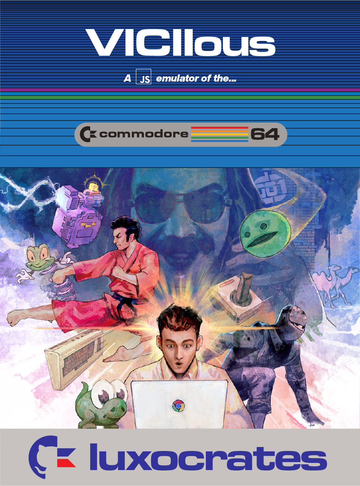
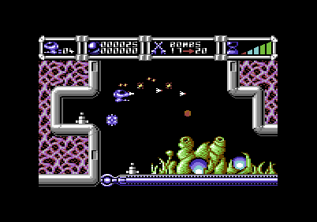
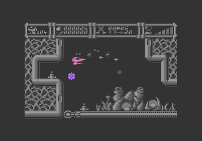
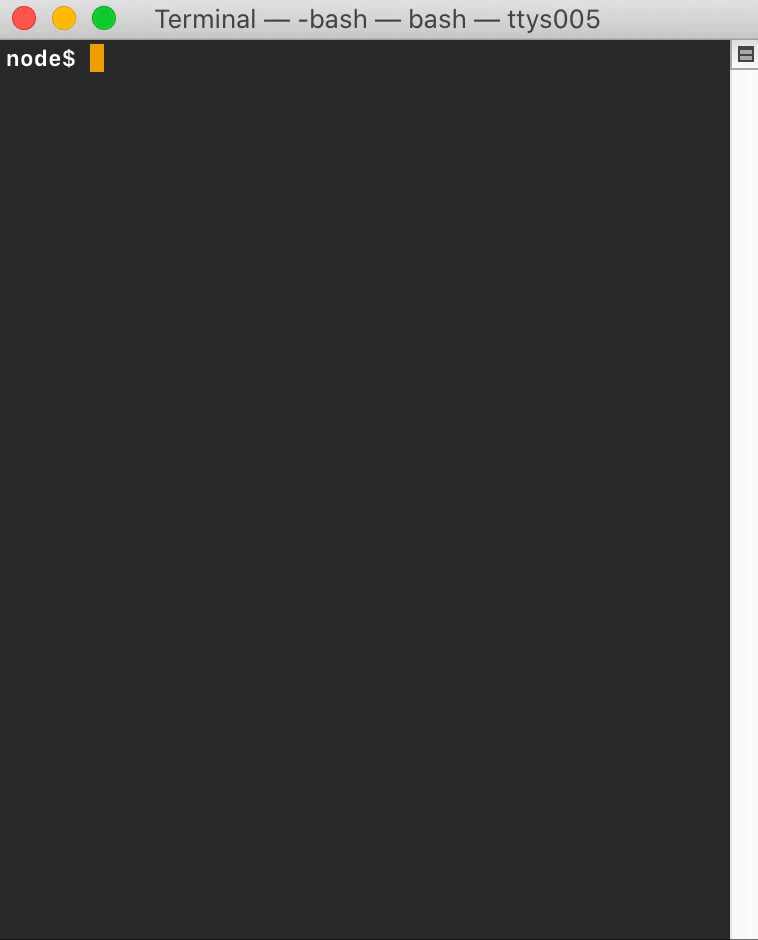

Viciious brings the outstanding capabilities of the Commodore 64 microcomputer to your web browser and terminal emulator.

 - Play thrilling arcade-style games in spectacular 320×200 high resolution. Its emulated VIC-II graphics chip brings ultra-realistic game worlds to life, in 16 dazzling colors.
 - Listen to exceptional high-fidelity audio, thanks to an emulated SID sound synthesizer delivering a nine-octave range from each of three simultaneous voices.
 - Run high-caliber business applications with its emulation of the powerful 1MHz 6510 microprocessor unit.
 - Write your own software using its versatile and easy-to-use BASIC programming language. Its capacious memory leaves your programs with a storage space just one byte shy of a nice, round, even 38,912 bytes.

## Quick Start

 - Open the `dist/web-prod/viciious.html` file in your web browser.
 - Drag-and-drop `.t64`, `.tap`, `.prg` or `.sid` files into the browser window.
 - Your cursor keys and Shift map to a joystick plugged into Control Port 2.
 - What’s written on your keyboard is probably what gets typed in.
 - Click anywhere on the page to open menus.

The emulator distribution is a single, self-contained HTML file that does not access the Internet.

## Purpose

Viciious was written for tinkering. It does a few things differently from other emulators, with the aim of facilitating playful exploration of the hardware and the software that ran on it. For example...

 - It offers a number of realtime ‘scopes’ — visualizations of what’s going on inside the machine. Use them to get an understanding of how the software’s working, like by coloring each pixel according to the sprite that generated it, or graphing which devices are accessing which RAM locations during a frame.

 - It assembles its own Basic interpreter and Kernal, from source, at runtime. Its inbuilt ‘half-assembler’ allows you to write 6502 opcodes as inline JavaScript.
 - It can run from Node.js, using a regular terminal emulator for input/output.

 - It preserves high-level audio commands and emulates the SID with the help of the AudioOscillator web audio API rather than as samples in a playback buffer.

To maximize ease-of-use, Viciious will continue to be developed as a self-contained HTML file which runs serverless.

## Limitations

See [limitations](limitations.md) document. TL;DR: Viciious emulates a PAL Commodore 64 in real-time, and makes some attempts to be cycle-accurate, but isn’t. It emulates a tape deck but no disk drive, and offers direct-injection of programs into memory for quick loading. All the major hardware components are present, but some features, like sound filtering, are absent. Its compatibility isn’t 100%, partly for the above reasons, and partly because of bugs. It _can_ run in real-time on mobile, but the UI is unsuitable.

 Don’t expect snapshot files to be interchangeable between versions pre v1.0.0.

## Building and Running

The pre-built `dist/web-prod/viciious.html` file is all you’ll need to get the emulator running. You can ignore this section unless you want to make changes, or run the emulator within your command line.

For all of the builds below, first [install Node.js](https://nodejs.org/en/download/) if you don’t have it. 

Next, clone this repo, and, from its root, run:

    $ npm ci

...to install package dependencies.

#### Web host: Dev loop

For development, start a local server using:

    $ npm start

...then point your web browser to `http://localhost:8080`. Changes you make to the sources will immediately trigger a recompile and reload.

In terms of the compiled emulator code, one key difference between dev and prod builds is that the dev build boots the virtual machine much quicker, by patching the Kernal to skip its startup RAM test.

#### Web host: Creating a single-file HTML distribution

To update the bundle at `dist/web-prod/viciious.html`, run the command:

    $ npm run build-web-prod

There’s also a development configuration bundle that you can build:

    $ npm run build-web-dev

...which outputs files to the `dist/web-dev` directory.

#### Node.js host: Running

As with the web-hosted target, this repo contains a pre-built bundle for the Node.js-hosted mode. Start it with:

    $ node dist/node/viciious.js <someprogram>

...where `<someprogram>` is a path to a `.t64`, `.tap`, `.prg` or `.sid` file (not that you’d get any sound out of the `.sid` in this mode), or a `.json` from a previous snapshot.

You can omit the program argument, in which case the emulator will boot to Basic.

#### Node.js host: Building

To update the bundle at `dist/node/viciious.js`, run:

    $ npm run build-node

You can also build to the bundle and run it with a single command, using:

    $ npm run run-node
    
#### Running the automated tests

The repo includes a build of Wolfgang Lorenz’s excellent emulator test suite. Run it with the command:

    $ npm run test-lorenz

Most, but not all, of the tests currently pass. All of the opcode and quasi-op tests succeed; none of the CIA tests do, and the others are hit-and-miss. (There are no tests for the VIC or SID). For each test that fails, the code will dump onto the terminal a view of the virtual screen at the moment of the timeout. A complete test run may take an hour or so.

## Controlling

By default, the emulator tries to map the keys on your keyboard to the same symbols on the target C64. If you press your cursor-up key, for example, you’ll see the C64’s cursor move up a row, even though the cursor-up was likely a single keypress on your computer, but a shift-cursor-down on the C64. This behavior suits easy use, but the menus also offer a more direct mapping, which allows for better compatibility at the expense of convenience.

The cursor keys also, by default, control a virtual joystick plugged into Control Port 2. Its fire button is mapped to your Shift key. Again, the menus let you reconfigure this. Note that some games won’t run unless the shift/cursor path is disabled, in which case expect to see pauses, or your character moving in unexpected directions.

As well as dropping program files into the browser window to boot them, you can drop in snapshot files. Take a snapshot using the UI; then, to save it, find the underlined link beneath its screen preview, and use your browser’s right-click menu to save the link to your filesystem.

## Licensing

The emulation code and UI assets in Viciious were authored from scratch and placed in the public domain.

Caveat: this does not include target code that the emulator runs which is included in this repo and bundled into the app. Specifically: the contents of the `rom` directory, the Wolfgang Lorenz test suite (`src/tests/lorenz-base64.js`), and the demo programs (`host/webFrontEnd/demos`). These files are derived from works by other authors, and no representation is made here as to their ownership or distribution terms.
